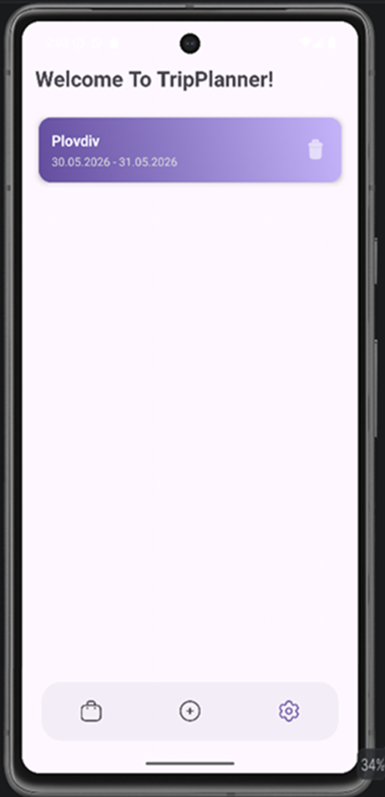
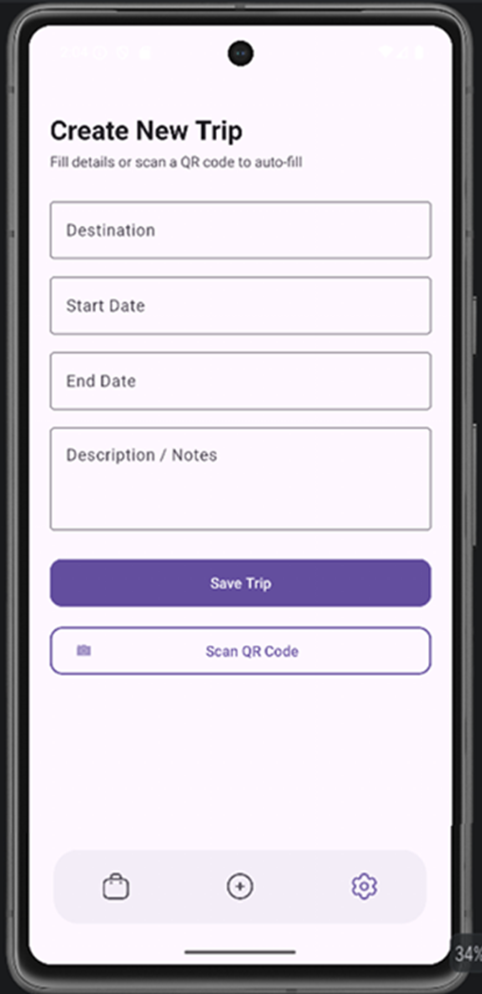
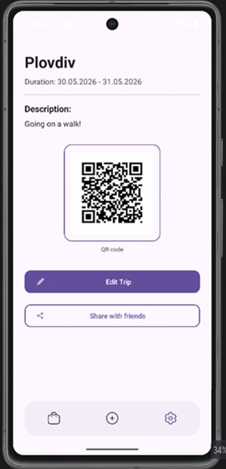
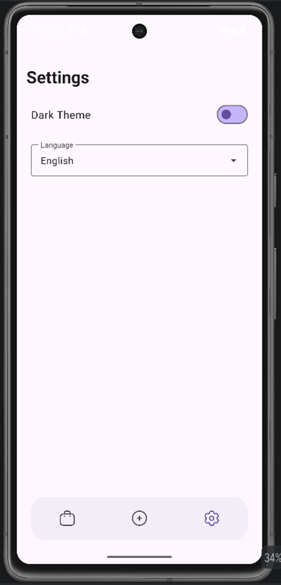

# TripPlanner

## Идея
**TripPlanner** е модерно и интуитивно мобилно приложение за управление на лични пътувания. Основната цел на проекта е да улесни потребителите при организирането, проследяването и споделянето на техните маршрути. Приложението решава проблема с разпръснатата информация за дати, дестинации и бележки, като събира всичко на едно място с бърз офлайн достъп. Основен акцент е поставен върху автоматизацията – чрез генериране и сканиране на QR кодове, потребителите могат да обменят детайли за пътувания помежду си за бързо попълване, без необходимост от ръчно въвеждане.

---

## Как работи
Приложението оперира изцяло локално, гарантирайки бързина и сигурност. Основният екран извлича и визуализира списък с пътувания от **Room база данни** чрез реактивни компоненти, които обновяват интерфейса при промяна. Потребителят добавя или редактира елементи чрез интерактивни форми, включващи календарен избор за валидация на датите.

При запис, данните се валидират за непразни полета и логическа последователност на датите, след което се капсулират в Entity обект и се записват асинхронно. Всеки запис автоматично генерира уникален двуизмерен QR код чрез енкодер, съдържащ структуриран текстов масив с детайлите на пътуването. Споделянето използва Android Share Intent за експорт на текстово съдържание. При сканиране, вграденият баркод анализатор прихваща стринга от камерата, парсва го по ключови думи (на български или английски) и динамично попълва текстовите полета в реално време преди финалния запис.

---

## Архитектура
Проектът е изграден по съвременната архитектурна схема **MVVM (Model-View-ViewModel)**, комбинирана с **Repository слой** за чиста отделеност на отговорностите (Separation of Concerns).

* **Model:** Включва `Trip` ентити класа, представляващ таблицата в SQLite, и `TripDao`, който дефинира SQL операциите.
* **Repository:** `TripRepository` служи като единствен източник на данни (Single Source of Truth) и абстрахира достъпа до базата данни.
* **ViewModel:** `TripViewModel` капсулира бизнес логиката, комуникира с репозиторито и излага данните към интерфейса чрез капсулован `LiveData` поток, запазвайки състоянието при ротация на екрана.
* **View (`Activity` / `Fragment`):** Наблюдава (observe) промените в LiveData и отговаря единствено за рендирането на UI.

### Примерен компонент от архитектурата:
```kotlin
class TripViewModel(application: Application) : AndroidViewModel(application) {

    private val repository: TripRepository

    //LiveData, list for all of the trips
    val allTrips: LiveData<List<Trip>>

    init {
        //initializing DAO, database and repo
        val tripDao = TripDatabase.getDatabase(application).tripDao()
        repository = TripRepository(tripDao)

        //turning flow to livedata
        allTrips = repository.allTrips.asLiveData()
    }

    //create
    fun insert(trip: Trip) = viewModelScope.launch(Dispatchers.IO) {
        repository.insert(trip)
    }

    //update
    fun update(trip: Trip) = viewModelScope.launch {
        repository.update(trip)
    }

    //delete
    fun delete(trip: Trip) = viewModelScope.launch(Dispatchers.IO) {
        repository.delete(trip)
    }
}
```
## Използвани технологии

Проектът е разработен съобразно съвременните практики за Android разработка и следва принципите на Material Design 3 за изграждане на модерен, последователен и достъпен потребителски интерфейс.

| Технология / Библиотека | Версия           | Предназначение |
|-------------------------|------------------|----------------|
| Kotlin | 1.9.24           | Основен език за разработка |
| Min SDK | 24 (Android 7.0) | Минимално поддържана версия на Android |
| Target SDK | 34 (Android 14)  | Последна стабилна таргетирана версия |
| Room Database | 2.6.1            | Локално съхранение и управление на данни |
| ZXing Embedded | 4.3.0            | Сканиране и генериране на QR кодове |
| Material Components | 1.11.0           | Material 3 компоненти, теми и диалози |

---

## Потребителски поток (User Flow)

### Начален екран (Home / All Trips)

Потребителят вижда списък с всички планирани пътувания, представени чрез Material 3 карти. При липса на записи се визуализира приветствено съобщение за празен списък.

### Добавяне и сканиране (New Trip)

Чрез долната навигация се отваря екран за създаване на ново пътуване. Потребителят може да въведе данните ръчно чрез интерактивна форма или да използва бутона **Scan QR Code**, който автоматично попълва информацията чрез камерата на устройството.

### Детайли за пътуване (Trip Details)

При избор на конкретно пътуване от списъка се отваря специализиран екран, показващ:

- дестинация;
- описание;
- начална дата;
- крайна дата;
- автоматично генериран QR код.

### Управление и споделяне

От екрана с детайли потребителят може:

- да редактира информацията за пътуването;
- да изтрие съществуващ запис;
- да сподели информацията чрез Android Share Intent.

### Настройки (Settings)

Екранът за настройки позволява:

- смяна на езика на приложението;
- превключване между **Light Mode** и **Dark Mode**;
- персонализиране на потребителското изживяване.

---

## Стъпки за стартиране

За локално компилиране и стартиране на проекта:

### 1. Клониране на хранилището

```bash
git clone https://github.com/MikaelaBaltova/MobileApps2026-2301681079.git
```

### 2. Отваряне на проекта

Отворете проекта чрез **Android Studio Hedgehog** или по-нова версия.

### 3. Gradle синхронизация

Изчакайте автоматичната Gradle синхронизация да завърши успешно.

### 4. Компилиране

```bash
./gradlew assembleDebug
```

### 5. Стартиране

Стартирайте приложението на:

- Android Emulator;
- физическо Android устройство.

---

## Тестови акаунти

Приложението не използва отдалечена автентикация и не изисква регистрация или вход в система.

Цялата функционалност е достъпна непосредствено след инсталация и работи в **Local-First** режим, което позволява безпроблемна демонстрация без необходимост от интернет връзка.

---

## Скрийншотове

Всички изображения и екранни снимки се намират в директорията:

```text
/docs/images
```

### Начален екран



### Създаване на пътуване



### Детайли за пътуване



### Настройки



---

## Основни функционалности

- Създаване на ново пътуване
- Редактиране на съществуващо пътуване
- Изтриване на записи
- Локално съхранение чрез Room Database
- Генериране на QR кодове
- Сканиране на QR кодове
- Споделяне чрез Android Share Intent
- Поддръжка на светла и тъмна тема
- Многоезична поддръжка
- Responsive дизайн

---

## Структура на проекта

```text
app/
├── kotlin/
│   ├── data/
│   ├── repository/
│   ├── ui/
│   └── viewmodel/
├── layout/
│   ├── activity_add_edit_trip/
│   ├── activity_main/
│   ├── activity_settings/
│   └── activity_trip_detail/
└── gradle scripts/
```

## Готово APK за инсталация
Директен линк към инсталационния:
 **[Изтегли от тук: app-release.apk](apk/app-release.apk)** *(Размер: ~5.2 MB)*